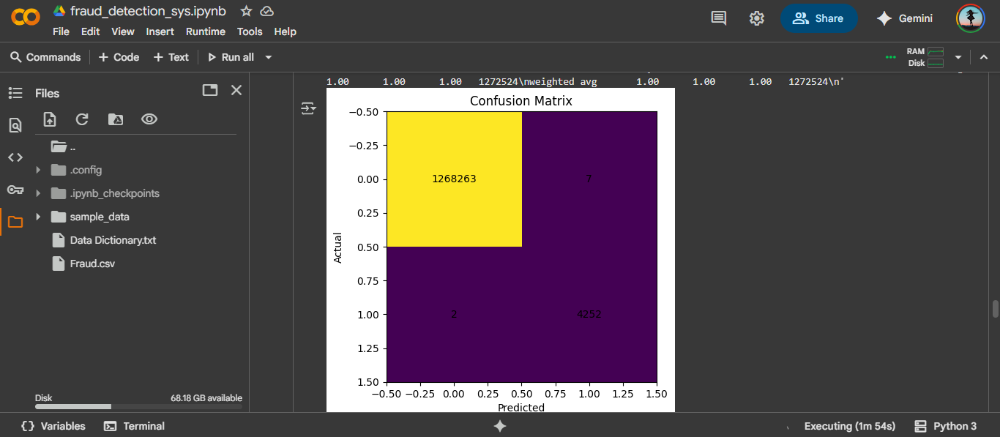
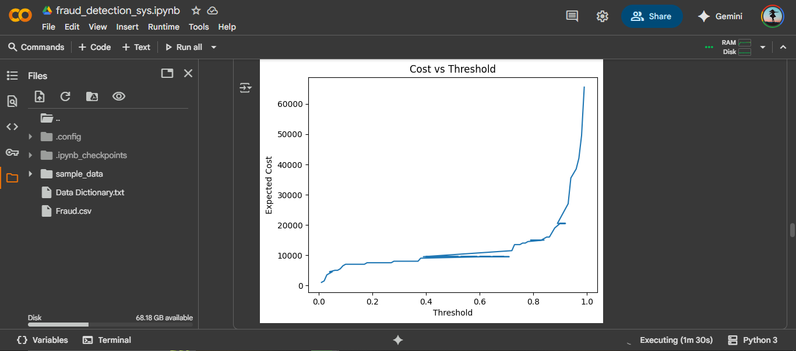
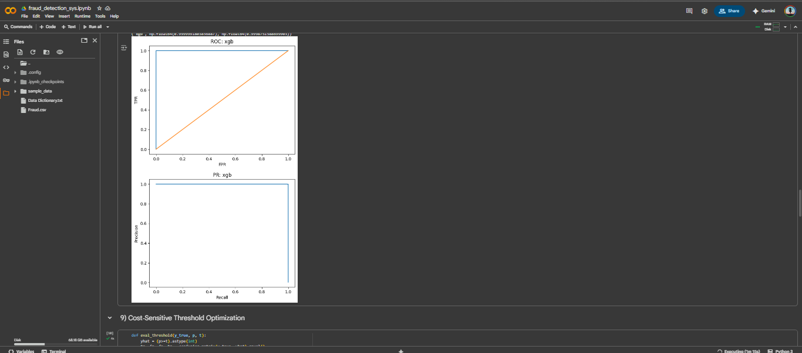

# Fraud Detection System

## Overview
• This project implements a **Fraud Detection System** using Python and machine learning.  
• The goal is to **analyze transaction data, detect fraudulent patterns, and provide insights**.  
• The project includes a working **Colab notebook**, a **sample dataset**, and **visual outputs** for reference.

---

## Repo Structure
Fraud-Detection-System/
│
├── notebooks/
│ └── Fraud_Detection_Colab.ipynb # Main Colab notebook with full code
├── data/
│ └── fraud_sample.csv # Small sample dataset
├── images/
│ └── roc_curve.png # ROC curve screenshot
│ └── cost_threshold.png # Cost threshold optimization screenshot
| └── confusion_matrix.png # Confusion Matrix screenshot
│ └── shap_values.png # SHAP values screenshot
├── requirements.txt # Required Python packages
├── README.md # This file
├── LICENSE
└── .gitignore

---

## How to Run

### Option 1: Using Google Colab (Recommended)
1. Go to [Google Colab](https://colab.research.google.com/).  
2. Click **File → Open notebook → GitHub**.  
3. Paste this repo URL: `https://github.com/pawniityagii/Fraud-Detection-System`  
4. Open `notebooks/fraud_detection_sys.ipynb`.  
5. Run all cells.  
   - The notebook uses the **sample dataset (`fraud_sample.csv`)** by default.  

### Option 2: Using Local Machine
1. Clone the repo:
   git clone https://github.com/pawniityagii/Fraud-Detection-System.git

2. Install required packages:
pip install -r requirements.txt

3. Open the notebook in Jupyter or VSCode.

---

## Dataset
• Sample Dataset: Included in data/fraud_sample.csv (small subset).
• Full Dataset (6.3M+ records): [Download here](google.com/url?sa=D&q=https://drive.google.com/uc%3Fexport%3Ddownload%26confirm%3D6gh6%26id%3D1VNpyNkGxHdskfdTNRSjjyNa5qC9u0JyV&ust=1758298440000000&usg=AOvVaw1WImSbYlkDRgs-e_xceoHQ&hl=en-GB)
• You can use it in Colab by mounting Google Drive and replacing the sample dataset path.

---

## Project Highlights
• Machine Learning Models: Logistic Regression, Gradient Boosting, LightGBM/XGBoost.
• Data Cleaning & Feature Engineering: Handling missing values, outliers, multicollinearity, and creating fraud-relevant features.
• Evaluation Metrics: ROC-AUC, PR-AUC, Precision/Recall, Confusion Matrix, Cost-sensitive threshold optimization.
• Explainability: SHAP values and permutation importance.

---

## Sample Outputs
<table> <tr> <td align="center">   <b>Confusion Matrix</b> </td> <td align="center">   <b>Cost Threshold Optimization</b> </td> </tr> <tr> <td align="center">   <b>SHAP Values</b> </td> <td align="center">   <b>ROC Curve</b> </td> </tr> </table>

---

## Notes
• The notebook is ready-to-run in Colab.
• Use the sample dataset for quick tests; full dataset is needed for full-scale analysis.
• All outputs and graphs shown in the notebook correspond to the dataset provided.

---

Author
Pawni Tyagi

Final Year B.Tech Computer Science

Project for learning and demonstration of ML-based fraud detection.
