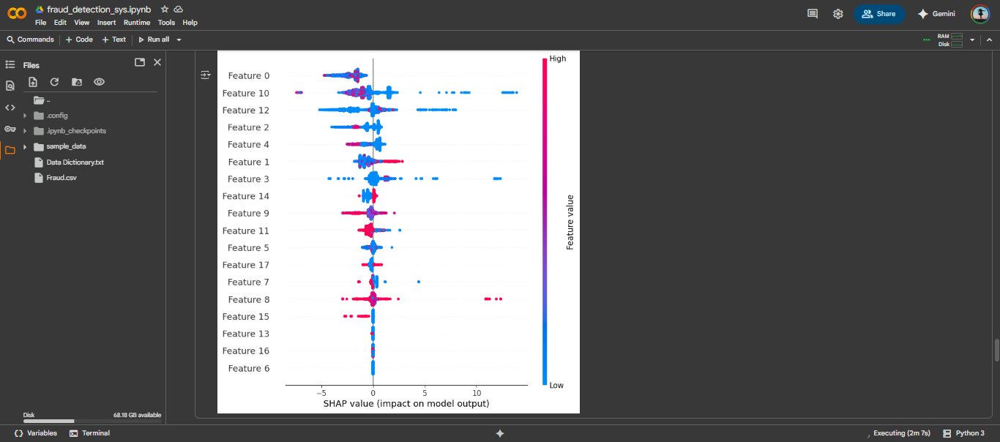

**Tags:** `Python` • `Machine Learning` • `Fraud Detection` • `Supervised Learning` • `Data Analysis` • `ROC-AUC` • `SHAP`  

# 💳 Fraud Detection System
> Detecting fraudulent transactions using Machine Learning.

A project that applies **Machine Learning models** to detect fraudulent patterns in transaction data. The system combines **data cleaning, feature engineering, supervised learning, and explainability** to identify fraud effectively and provide actionable insights.

## 📌 Features

- Cleaned and preprocessed transaction data (handling missing values, outliers, multicollinearity)  
- Engineered fraud-relevant features (balance deltas, errors, ratios, merchant indicators)  
- Applied multiple ML models: Logistic Regression, Gradient Boosting, LightGBM/XGBoost  
- Evaluated performance with ROC-AUC, PR-AUC, Precision/Recall, Confusion Matrix  
- Explainable results using SHAP values and permutation importance  

## 🚀 Tech Stack & Environment
This project was developed using Google Colab — a cloud-based Jupyter environment that makes it easy to run and share notebooks without any setup.  

⚙️ Built With:  
🐍 Python 3.x  
🧠 scikit-learn (ML modeling)  
🧾 Pandas & NumPy (data wrangling)  
📊 Matplotlib & Seaborn (visualizations)  

▶️ Run it Yourself  
Click below to open the notebook in Colab and try it out:  
[Open Notebook in Colab](https://colab.research.google.com/github/pawniityagii/FraudDetectionSystem/blob/main/notebooks/fraud_detection_sys.ipynb)

## 📂 Project Structure

FraudDetectionSystem/
├── notebooks/              # Main Colab notebook with full code  
├── data/                   # Sample dataset (`fraud_sample.csv`)  
├── images/                 # Screenshots of outputs/graphs  
├── requirements.txt        # List of dependencies  
├── README.md               # This file  
├── LICENSE  
└── .gitignore  

## 🛠️ Installation & Usage

1. Clone the repository:
git clone https://github.com/pawniityagii/Fraud-Detection-System.git

3. Install required packages:
pip install -r requirements.txt

3. Run the notebook in Colab:
- Open `notebooks/fraud_detection_sys.ipynb` and run all cells  
- Use `data/fraud_sample.csv` for quick testing  
- To run on the full dataset (6.3M+ rows), download it from the link below and replace the sample path in the notebook  

## 📊 Dataset

- Sample Dataset: Included in `data/fraud_sample.csv`  
- Full Dataset (6.3M+ records): https://drive.usercontent.google.com/download?id=1VNpyNkGxHdskfdTNRSjjyNa5qC9u0JyV&export=download&authuser=0

## 📈 Results & Insights

- Model Performance: Evaluated with ROC-AUC, PR-AUC, and confusion matrix  
- Explainability: SHAP plots highlight which features contribute most to fraud predictions  
- Business Impact: Provides actionable insights for fraud prevention strategies

## 📸 Sample Outputs

<table> <tr> <td align="center">   <b>Confusion Matrix</b> </td> <td align="center">   <b>Cost Threshold Optimization</b> </td> </tr> <tr> <td align="center">   <b>SHAP Values</b> </td> <td align="center">   <b>ROC Curve</b> </td> </tr> </table>

## 🧠 Future Enhancements

- Deploy a live dashboard for monitoring fraud in real-time  
- Add automated alerts for high-risk transactions  
- Integrate more advanced models (e.g., XGBoost tuning, ensemble learning)  
- Implement a retraining pipeline with incoming transaction data  

## 🙋 About Me

I'm a Computer Science undergrad passionate about turning data into actionable insights. This project is a practical demonstration of applying ML to solve real-world fraud detection challenges.

Let's connect:  
LinkedIn: https://linkedin.com/in/pawnityagi  
Portfolio: https://pawnityagi.my.canva.site  
Website: https://pawni-tyagi-xc7s61k.gamma.site/  
GitHub: https://github.com/pawniityagii

If this repo helped or inspired you, leave a ⭐ — it makes my day!
